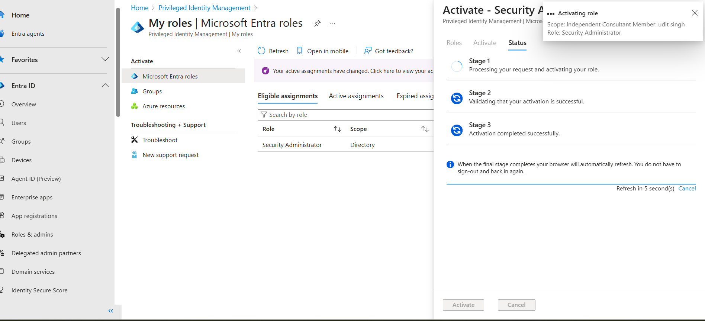
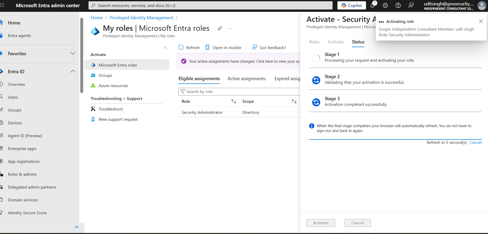
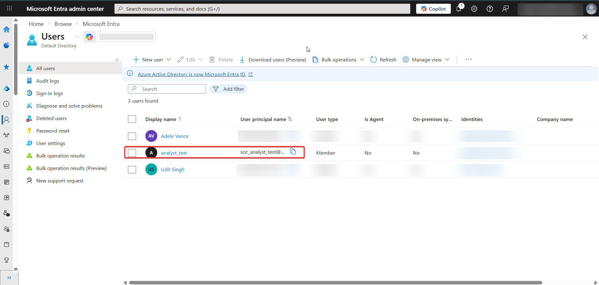

# Azure-Privileged-Identity-Management-Lab
Implementing Just-In-Time (JIT) access using Entra ID P2 — eliminating standing admin roles to enforce Zero Trust security in a real Azure tenant.

# 🛡️ Azure Security Lab: Entra ID P2 & PIM Implementation

## 🎯 Objective
The goal of this project is to implement **Just-In-Time (JIT)** access to reduce the attack surface of an Azure Tenant. By using **Microsoft Entra Privileged Identity Management (PIM)**, we ensure that no user has "Standing Access" to sensitive administrative roles.

## 🛠️ Step-by-Step Implementation

### 1. Tenant & Licensing Setup
- Configured a dedicated security tenant: `govsecurity.onmicrosoft.com`.
- Activated **Microsoft Entra ID P2 / Governance** trial for PIM capabilities.

### 2. Configuring Role Eligibility
- Assigned the **Security Administrator** role as **'Eligible'** to a test user.
- **Evidence:** 

### 3. Activation Workflow (The Security Guard)
- Configured policies requiring:
  - **MFA** for every activation.
  - **Business Justification** for audit logs.
- **Workflow in Action:**
  

### 4. Verification & Audit
- Verified that after 4 hours, the role is automatically revoked.
- **Active Assignment Proof:**
  

## 🧠 Key Takeaways for SOC/Cloud Security
- **Zero Trust:** Never trust, always verify (MFA).
- **Least Privilege:** Access is granted only when needed and for a limited time.
- **Audit Compliance:** Every elevation is logged for forensic investigations.
